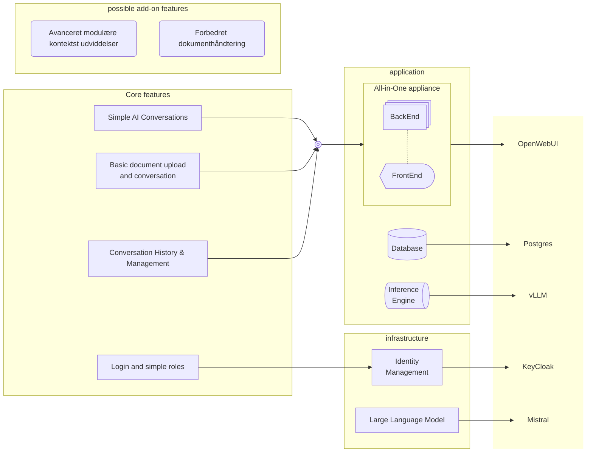

# Solution Landscape

_A simple solution landscape, mapping features to components and their current implementation dependencies._

```mermaid

flowchart LR
 subgraph s1[" "]
        Postgres["Postgres"]
        OpenWebUI["OpenWebUI"]
        KeyCloak["KeyCloak"]
        Mistral["Mistral"]
        vLLM["vLLM"]
  end
 subgraph subGraph1["All-in-One appliance"]
        FrontEnd["FrontEnd"]
        BackEnd["BackEnd"]
  end
 subgraph application["application"]
        subGraph1
        Database["Database"]
        LLM_API["Inference<br>Engine"]
  end
 subgraph infrastructure["infrastructure"]
        IdM["Identity<br>Management"]
        LLM["Large Language Model"]
  end
 subgraph s3["Core features"]
        Chat["Simple AI Conversations"]
        DocChat["Basic document upload<br> and conversation"]
        History["Conversation History & Management"]
        Login["Login and simple roles"]
  end

  subgraph feat["possible add-on features"]
    A("Avanceret modulære kontektst udviddelser")
    B("Forbedret dokumenthåndtering")
  end

    Database --> Postgres
    IdM --> KeyCloak
    DocChat --> n1["Frames Circle"]
    History --> n1
    Chat --> n1
    n1 --> subGraph1
    subGraph1 --> OpenWebUI
    Login --> IdM
    LLM --> Mistral
    BackEnd -.- FrontEnd
    LLM_API --> vLLM

    FrontEnd@{ shape: display}
    BackEnd@{ shape: procs}
    Database@{ shape: cyl}
    LLM_API@{ shape: h-cyl}
    n1@{ shape: fr-circ}
    style Postgres stroke-width:1px,stroke-dasharray: 0,stroke:none,fill:transparent
    style OpenWebUI stroke-width:1px,stroke-dasharray: 0,stroke:none,fill:transparent
    style KeyCloak stroke-width:1px,stroke-dasharray: 0,stroke:none,fill:transparent
    style Mistral stroke-width:1px,stroke-dasharray: 0,stroke:none,fill:transparent
    style vLLM stroke:none,fill:transparent
    style s1 stroke:none
```

